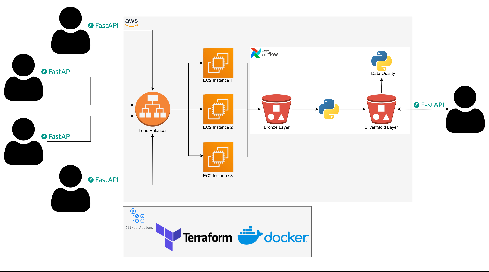
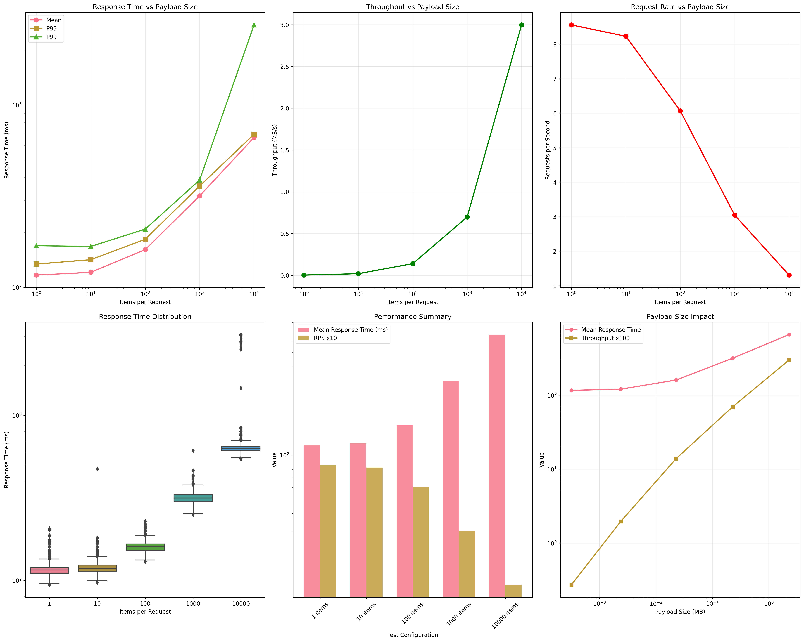

## Project Overview

The main goal of this project is to gain a solid, hands-on understanding of how modern data engineering tools and cloud components fit together. I wanted to move beyond theory and actually build something that could help me form opinions and develop intuition about how these systems work in practice.

To do that, I designed and built a small, end-to-end data platform that simulates a real-world workflow — from data ingestion to data access — using **AWS**, **FastAPI**, **Airflow**, **Docker**, **Terraform**, and **GitHub Actions**.

---

## System Description

At a high level, the system allows users (for example, store locations in a company) to submit their data via a **FastAPI** endpoint. The incoming data is stored in an **S3 bucket**, representing the **bronze layer**. From there, **Airflow** orchestrates a pipeline that regularly processes and moves the data into a **silver/gold layer**, stored in another S3 bucket.

The pipeline performs typical **ETL** tasks — cleaning, transforming, and validating the data — ensuring it’s ready for analytics or downstream consumption. Once processed, a second **FastAPI** service exposes this curated data for querying and access.

Deployment is designed to be **fully automated**, using **Docker** for containerization, **Terraform** for infrastructure provisioning, and **GitHub Actions** for CI/CD. The system is built to be scalable, deployable and easy to extend.

---

## Example Flow

To illustrate the flow, imagine a company with multiple stores. Each store submits sales or transactional data several times per day through the ingestion API.

Since performance is a key goal, the API performs **no heavy validation** during submission. As traffic scales with the number of stores and requests, an **AWS Load Balancer** distributes the incoming load across multiple EC2 instances to maintain performance and reliability.

Every few minutes, **Airflow** picks up the raw JSON data from the bronze layer, cleans it, transforms it into **Parquet format**, and writes it to the silver/gold layer. Data quality checks are applied at this stage to ensure the final dataset is consistent and accurate.

Finally, the curated data can be queried through the second FastAPI service, allowing users or downstream systems to easily access clean, reliable information.

---

## Tech Stack

* **FastAPI** – APIs for data ingestion and access
* **AWS S3** – Bronze and Silver/Gold data layers
* **AWS EC2** – Compute for API servers
* **AWS Load Balancer** – Traffic distribution
* **Airflow** – ETL orchestration and scheduling
* **Docker** – Containerization of APIs and services
* **Terraform** – Infrastructure as code
* **GitHub Actions** – CI/CD and deployment automation

---

## Purpose

The main objective of this project is **learning by doing** — building something practical to understand how data systems are designed, deployed, and maintained in real-world scenarios. It’s both a **hands-on learning exercise** and a **working demo** that can serve as a foundation for more complex data engineering projects.

---

## Performance Benchmarking

To better understand how the system performs under different workloads, I conducted a series of benchmarking tests using the ingestion API.

Each test simulated **1,000 transactions** with varying payload sizes:

* 1 item per request
* 10 items per request
* 100 items per request
* 1,000 items per request
* 10,000 items per request

These tests provided insight into the system’s behavior under **high I/O conditions**, allowing the calculation of performance metrics such as **mean response time**, **P95** and **P99** latencies.

As expected, the results show that response times increase as payload size grows, while throughput (MB/s) scales proportionally up to a certain point. The system maintains strong performance for small and medium payloads.

What remains to be tested is the system’s performance under **high-concurrency conditions** - when handling a large swarm of simultaneous requests.

